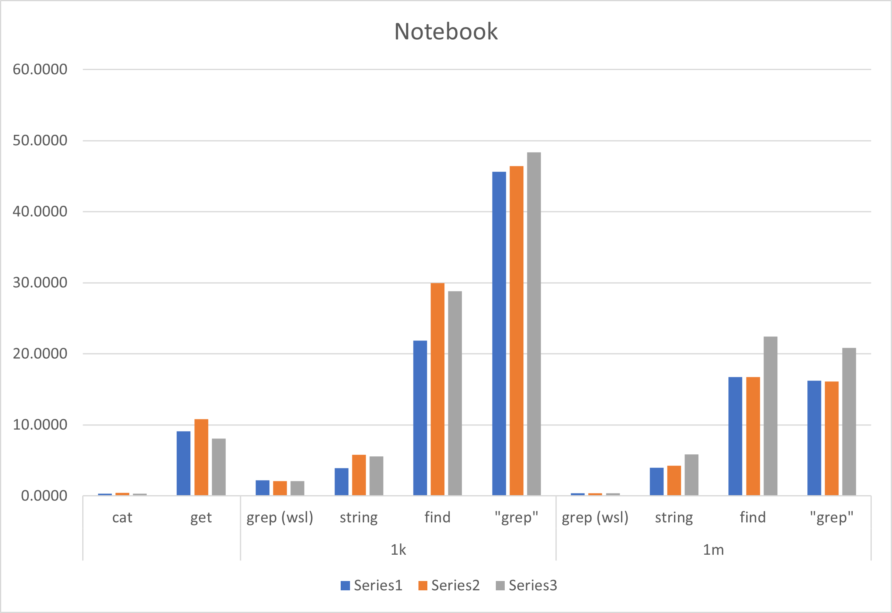
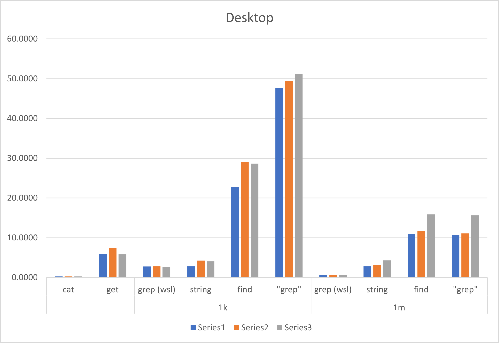
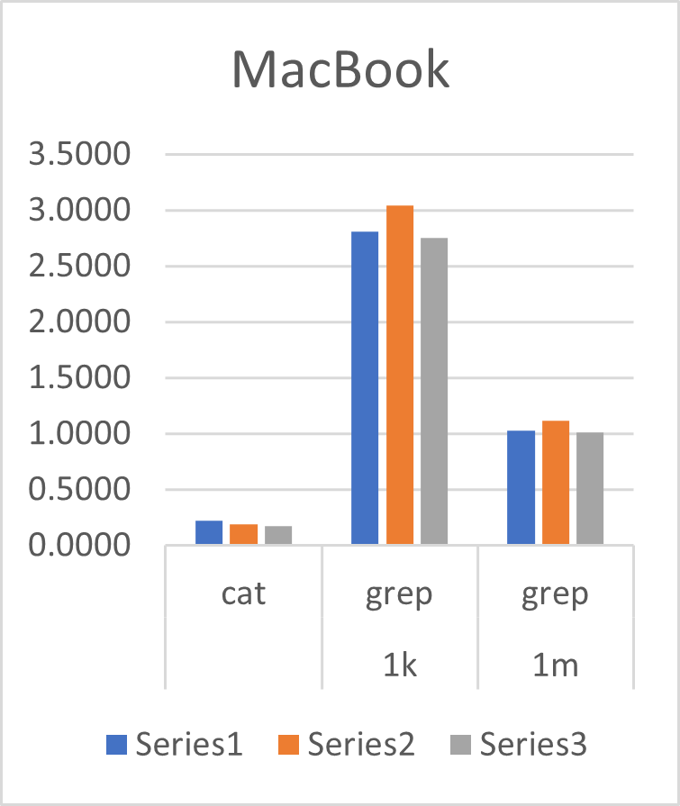

# String Matching Speedtest

A speed test for string matching functions in windows, to see which one is faster.

Contenders:

- `Select-String`
- `findstr`
- `grep` (installed through chocolatey)
- `grep` (WSL / "linux native")

## Files

- `measure_test.ps1`
- `measure_test.sh`
- `testfile_1k.csv`
- `testfile_1m.csv`
- `test_names.ps1`

## Testing Results

### Aggregated Table

All values in seconds

#### 1000 x 1000 Lines

|     Test      | Windows Notebook | Windows Desktop | MacBook Pro |
| :-----------: | :--------------: | :-------------: | :---------: |
|     grep      |      2.1353      |      2.777      |   2.8683    |
| Select-String |      5.0859      |     3.7363      |             |
|    findstr    |     26.8847      |     26.8028     |             |
|    "grep"     |     46.8075      |     49.3909     |             |

#### 1 x 1000000 Lines

|     Test      | Windows Notebook | Windows Desktop | MacBook Pro |
| :-----------: | :--------------: | :-------------: | :---------: |
|     grep      |      0.3887      |      0.594      |    1.053    |
| select-string |      4.7046      |     3.4262      |             |
|    findstr    |     18.6236      |     13.4115     |             |
|    "grep"     |     17.7344      |     12.4564     |             |

#### cat vs Get-Content

|    Test     | Windows Notebook | Windows Desktop | MacBook Pro |
| :---------: | :--------------: | :-------------: | :---------: |
|     cat     |      0.3757      |     0.2517      |   0.1967    |
| Get-Content |      9.3394      |     6.4419      |             |

### Commands

Windows:

```pwsh
.\measure-test.ps1
```

Linux:

```bash
chmod +x ./measure-test.sh
./measure-test.sh
```

### Test-Device 1

My notebook.

| Category |     Test      |  Run 1  |  Run 2  |  Run 3  |   AVG   |
| :------: | :-----------: | :-----: | :-----: | :-----: | :-----: |
|    k     |  grep (WSL)   |  2.22   |  2.078  |  2.108  | 2.1353  |
|          | Select-String | 3.8927  | 5.8190  | 5.5461  | 5.0859  |
|          |    findstr    | 21.8786 | 29.989  | 28.7945 | 26.8847 |
|          |    "grep"     | 45.6204 | 46.4426 | 48.3596 | 46.8075 |
|    m     |  grep (WSL)   |  0.374  |  0.402  |  0.390  | 0.3887  |
|          | Select-String | 3.9676  | 4.2674  | 5.8787  | 4.7046  |
|          |    findstr    | 16.7178 | 16.7199 | 22.4331 | 18.6236 |
|          |    "grep"     | 16.2501 | 16.1128 | 20.8402 | 17.7344 |
|    -     |   cat (WSL)   |  0.35   |  0.437  |  0.34   | 0.3757  |
|          |  Get-Content  | 9.1175  | 10.8259 | 8.0747  | 9.3394  |



#### Hardware 1

```plain
CPU = Intel(R) Core(TM) Ultra 7 155H (16C/22T)
RAM = 32GB 8 "Slots" (soldered?) 6400 MT/s
SSD = Micron NVMe 1TB
# Highly unlikely relevant
GPU = NVIDIA GeForce RTX 4060 Laptop GPU
```

#### Software 1

```plain
Microsoft Windows 11 Pro
10.0.26100 N/A Build 26100
PowerShell          5.1.26100.4768
Select-String       3.1.0.0
findstr.exe         10.0.26100.1150
grep.exe (GNU grep) 3.11
# WSL
Ubuntu 22.04.5 LTS
grep (GNU grep)     3.7
```

#### Result Windows 1

```plain
PS C:\Users\flammalpha\tmp> .\measure_test.ps1
Reading TestData
Time to complete: 10.4539514 seconds
Measuring 1000x Select-String 1K
Time to complete: 3.8235561 seconds
Measuring 1000x findstr 1K
Time to complete: 21.3920989 seconds
Measuring 1000x grep 1K
Time to complete: 43.1739563 seconds
Measuring 1x Select-String 1M
Time to complete: 3.9422012 seconds
Measuring 1x findstr 1M
Time to complete: 16.1522328 seconds
Measuring 1x grep 1M
Time to complete: 20.468683 seconds
```

#### Result Linux 1 (WSL)

```plain
flammalpha@KINITO:/mnt/c/Users/flammalpha/git/testing/string-matching$ ./measure_test.sh
Timing cat testfile_1k.csv and testfile_1m.csv

real    0m0.312s
user    0m0.124s
sys     0m0.119s

Measuring 1000x grep 1K

real    0m2.004s
user    0m0.721s
sys     0m0.955s

Measuring 1x grep 1M

real    0m0.422s
user    0m0.273s
sys     0m0.147s
```

### Device 2

My desktop PC

| Category |     Test      |  Run 1  |  Run 2  |  Run 3  |   AVG   |
| :------: | :-----------: | :-----: | :-----: | :-----: | :-----: |
|    k     |  grep (WSL)   |  2.773  |  2.814  |  2.744  |  2.777  |
|          | Select-String | 22.7356 | 29.0158 | 28.6570 | 26.8028 |
|          |    findstr    | 47.6215 | 49.4170 | 51.1341 | 49.3909 |
|          |    "grep"     | 2.8537  | 4.2564  | 4.0988  | 3.7363  |
|    m     |  grep (WSL)   |  0.593  |  0.595  |  0.594  |  0.594  |
|          | Select-String | 2.8433  | 3.1193  | 4.3167  | 3.4264  |
|          |    findstr    | 10.9166 | 11.7150 | 15.9064 | 12.8460 |
|          |    "grep"     | 10.6134 | 11.0977 | 15.6581 | 12.4564 |
|    -     |   cat (WSL)   |  0.254  |  0.251  |  0.25   | 0.2517  |
|          |  Get-Content  | 5.9663  | 7.4988  | 5.8607  | 6.4419  |



#### Hardware 2

```plain
CPU = AMD Ryzen 9 7900X (12C/24T)
RAM = 64GB 2 Slots 6000MT/s
SSD = Samsung SSD 970 Evo Plus 2TB
# Highly unlikely relevant
GPU = AMD Radeon RX 6900 XT
```

#### Software 2

```plain
Microsoft Windows 11 Pro
10.0.26100 N/A Build 26100
PowerShell          5.1.26100.4768
Select-String       3.1.0.0
findstr.exe         10.0.26100.1150
grep.exe (GNU grep) 3.11
# WSL
Ubuntu 24.04.3 LTS
grep (GNU grep)     3.7
```

#### Result Windows 2

```plain
PS D:\Programming\testing\string-matching> .\measure_test.ps1
Reading TestData
Time to complete: 5.966261 seconds
Measuring 1000x Select-String 1K
Time to complete: 2.8537444 seconds
Measuring 1000x findstr 1K
Time to complete: 22.7355536 seconds
Measuring 1000x grep 1K
Time to complete: 47.6215143 seconds
Measuring 1x Select-String 1M
Time to complete: 2.8432733 seconds
Measuring 1x findstr 1M
Time to complete: 10.9165714 seconds
Measuring 1x grep 1M
Time to complete: 10.6134005 seconds
```

#### Result Linux 2 (WSL)

```plain
flammalpha@KTINOS:/mnt/d/Programming/testing/string-matching$ ./measure_test.sh
Timing cat testfile_1k.csv and testfile_1m.csv

real    0m0.254s
user    0m0.062s
sys     0m0.144s

Measuring 1000x grep 1K

real    0m2.773s
user    0m1.935s
sys     0m1.860s

Measuring 1x grep 1M

real    0m0.593s
user    0m0.303s
sys     0m0.409s
```

### Device 3

My work notebook

| Category | Test  | Run 1 | Run 2 | Run 3 |  AVG   |
| :------: | :---: | :---: | :---: | :---: | :----: |
|    k     | grep  | 2.808 | 3.044 | 2.753 | 2.8683 |
|    m     | grep  | 1.024 | 1.12  | 1.015 | 1.053  |
|    -     |  cat  | 0.225 | 0.188 | 0.177 | 0.1967 |



#### Hardware 3

```plain
MacBookPro18,3
CPU = Apple M1 Pro 8 Cores (6 performance and 2 efficiency)
RAM = 16GB
Firmware 11881.140.96
```

#### Software 3

```plain
macOS  15.6 (24G84)
Darwin 24.6.0
grep   2.6.0-FreeBSD
```

#### Result macOS

```plain
➜  string-matching git:(master) ✗ ./measure_test.sh
Timing cat testfile_1k.csv and testfile_1m.csv

real    0m0.188s
user    0m0.090s
sys 0m0.131s

Measuring 1000x grep 1K

real    0m3.044s
user    0m1.726s
sys 0m1.987s

Measuring 1x grep 1M

real    0m1.120s
user    0m0.985s
sys 0m0.445s
```

## Conclusions

- The actual `grep` for Linux, even if through WSL, is a lot faster than the Windows native implementations.
- Even the `cat` on WSL vs `Get-Content` through PowerShell makes a definite difference - maybe there is another test needed

## Remarks

- The tests seem to slow down the more often they are executed, slowly leveling out (I tested 10 runs in a row at some point) which leads me to believe there might be some terminal buffer issue - further testing with fresh Terminal/PowerShell sessions is needed.

## References

- [grep for windows](https://github.com/mbuilov/grep-windows)
- [chocolatey](https://chocolatey.org/)
